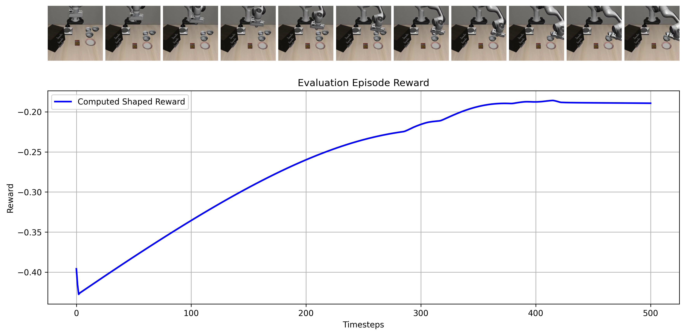

# HW3: Making a Generalist Robotics Policy with Reinforcement Learning

## Overview

In this assignment, you will move from offline imitation learning to online reinforcement learning on LIBERO tasks. The main goal is not just to get one policy to work, but to compare different ways of bringing reinforcement learning into a robotics policy pipeline. It is recommended to read the full assignment before starting.

You will train and compare three policies:

1. A dense policy that uses privileged state information and is trained with PPO.
2. A transformer policy initialized from your HW1 model and fine-tuned with RL.
3. A transformer policy first trained from a dense teacher with DAgger, then improved with RL.

This assignment is intentionally less scaffolded than HW1 and HW2. There is no complete PPO, DAgger, or GRPO reference implementation in this repository. You are expected to build the training code yourself, while reusing the existing model classes, Hydra config style, and simulation evaluation utilities where appropriate.

## Recommended Starting Points in This Repo

Create new scripts inside `hw3/`. The cleanest approach is usually to create dedicated scripts such as:

- `hw3/grp_model.py`
- `hw3/train_dense_rl.py`
- `hw3/train_dagger.py`
- `hw3/train_transformer_rl.py`

Equivalent organization is acceptable, but your submission must make it obvious how each experiment is reproduced from the command line. 

## Part 1: Train a Dense Policy with PPO [2pts]

Implement PPO for a policy that observes dense privileged state, such as pose and gripper state, instead of images. This is the simplest setting and should be your first working RL baseline.

Use a dense reward function for this part, an example is shown below: 

```
bowl_id = env_sim.model.body_name2id("akita_black_bowl_1_main")
bowl_pos = env_sim.data.body_xpos[bowl_id]
plate_id = env_sim.model.body_name2id("plate_1_main")
plate_pos = env_sim.data.body_xpos[plate_id]

bowl_rel = (bowl_pos - eef_pos).astype(np.float32)
plate_rel = (bowl_pos - plate_pos).astype(np.float32)

reward_gripper_bowl = -np.linalg.norm(bowl_rel)
reward_gripper_plate = -np.linalg.norm(plate_rel)
reward = reward_gripper_plate + reward_gripper_bowl
return float(reward)
```

Include your code for the reward function in the report (or you can use the one provide above). Explain your choice of the dense reward function as well as the expected behavior of the policy. Be specific about the behavior, and explain if it aligns with what would be an optimal policy.

### Requirements

- Use a dense policy network, not the image transformer, for this part.
- Train on at least one LIBERO task.
- Implement the full PPO update yourself: rollout collection, return/advantage computation, clipped surrogate objective, and value loss.
- Log episode return, success rate, policy loss, value loss, entropy, and any normalization statistics you use.

### What to Run

Your code must support a reproducible command-line interface. A typical command should look like:

```bash
python hw3/train_dense_rl.py \
	experiment.name=hw3_dense_ppo_seed0 \
	r_seed=0 \
	sim.task_set=libero_spatial \
	sim.eval_tasks=[9] \
	training.total_env_steps=200000 \
	training.rollout_length=128 \
	training.ppo_epochs=10 \
	training.minibatch_size=256
```

Run at least 3 seeds for your main dense PPO result. Name them consistently, for example:

- `hw3_dense_ppo_seed0`
- `hw3_dense_ppo_seed1`
- `hw3_dense_ppo_seed2`

### Deliverables for Part 1

- A reward learning curve over environment steps.
- Final success rate over evaluation episodes.
- One failure case and a short explanation of what caused it.
- A brief justification for your PPO design choices, including advantage normalization, reward scaling, and whether you used GAE.

## Part 2: Fine-Tune a Transformer Policy with RL [6pts]

### RL Finetuning 

After pretraining a model, RL finetuning is a method to improve the model's performance on a specified task. 

RL is preferred when optimal actions cannot be obtained from demonstrations, such as fine-grained control or other difficult to perform tasks. 

In this section, the goal is to compare training results when using two different finetuning strategies:  
Initialize the transformer policy from your HW1 model, then fine-tune it with RL.

### Requirements

- Start from your trained HW1 checkpoint, not random initialization.
- Reuse the transformer policy architecture from `mini-grp/grp_model.py` unless you can justify a change.
- Keep the policy and value function separate. Do not simply tack a value head onto the transformer unless you clearly justify and analyze that choice.

### What to Run

Your training command should make the initialization path explicit, for example:

```bash
python hw3/train_transformer_rl.py \
	experiment.name=hw3_transformer_ppo_seed0 \
	r_seed=0 \
	init_checkpoint=/path/to/your/hw1/miniGRP.pth \
	rl.algorithm=ppo \
	sim.task_set=libero_spatial \
	sim.eval_tasks=[9]
```

At minimum, report one PPO fine-tuning result for the transformer and compare it against the dense baseline from Part 1.

### Required Analysis

- For each part, compare sample efficiency against the dense PPO policy.
- Explain which parts of the transformer transferred well from HW1 and which did not.
- Show whether RL fine-tuning improves over the frozen or purely behavior-cloned initialization.
- Create a figure using your best model, where the top row are sampled frames, and plot the trained value function as well as the implemented reward function on those sampled states. An example is shown below with the example reward function:



### (a) PPO objective [2pts]

Modify your code from part 1 to perform online updates on your transformer action model and implemented value function.

### (b) RLHF with GRPO

As you may have noticed, training a value function estimation may not be easy. Next we will implement GRPO, a method that finetunes policies that do not explicitly model a value function. GRPO was first popularized in LLMs due to this property, since LLMs only model the policy. We will explore two different methods of grouping. 

### (c) GRPO with ground truth resets [2pts]

A core part of GRPO is grouping trajectories that start from an initial starting state. We will first cheat by resetting the simulation to the same initial state, before utilizing your results from HW2 to generate trajectories.

Explain in the report how the sampled trajectories differ from one another, and how the loss is calculated. Make sure to also include your implementation details of how you collect, store, and sample the trajectories. Finally, include hyperparameters changes enabled by GRPO over PPO if applicable.

### (d) GRPO in world models [2pts]

In the real world, we cannot reset the environment to the same initial state. Instead, we can use our trained world model to predict the next state given the current state and action. Then, we can label the trajectories and use them to update our policy. 

Report the trajectory length generated by the world model, as well as how they are used in training (e.g. how you decide to bootstrap them). Explain how the reward signal is provided, and how that might cause issues during training.

### Deliverables

- Compare PPO and GRPO on the same initialized student.
- Show at least one plot where GRPO behaves differently from PPO.

## Part 3 (Optional): Use a Dense Teacher and DAgger [2pts]

Instead of directly fine-tuning the transformer from HW1 or the provided model, use the dense policy from Part 1 as a teacher. Train your transformer policy with DAgger by performing [on-line relabeling of actions](https://thinkingmachines.ai/blog/on-policy-distillation/). Note that this form of supervision is much more dense than a reward model, either ground truth from the environment (parts a-c) or from the learned world model (part d).

Explain the details of the implementation in the report. 

### Requirements

- Use the dense policy to label actions for states visited by the student.
- Aggregate data over multiple iterations rather than collecting only one imitation dataset.
- Save the intermediate datasets or rollout logs used for DAgger.

### What to Run

Your interface should support a command such as:

```bash
python hw3/train_dagger.py \
	experiment.name=hw3_dagger_seed0 \
	r_seed=0 \
	teacher_checkpoint=/path/to/dense_policy.pth \
	student_init_checkpoint=/path/to/your/hw1/miniGRP.pth \
	dagger.num_rounds=10 \
	dagger.rollouts_per_round=20
```

### Required Analysis

- Compare DAgger initialization against direct PPO fine-tuning from HW1.
- Report whether the teacher improves early performance or stability.
- Identify one case where the teacher hurts the student and explain why.

## Comparing the Three Policy Families

Create plots and tables comparing:

- Dense PPO policy
- Transformer initialized from HW1 then fine-tuned with PPO
- Transformer initialized with DAgger then fine-tuned with PPO
- Transformer initialized with DAgger then fine-tuned with GRPO

At minimum, include:

- Success rate vs environment steps
- Average return vs environment steps
- Wall-clock training cost
- One qualitative failure example for each method

Your report should answer these questions:

1. Which approach is most sample efficient?
2. Which approach is most stable across seeds?
3. When does privileged-state training help, and when does it stop helping?
4. Does DAgger meaningfully improve RL fine-tuning, or does it mostly speed up early learning?

## How to Evaluate Runs

Use the existing evaluation code as a starting point. If your new checkpoint format is not compatible with `mini-grp/sim_eval.py`, adapt `hw3/sim_eval.py` so that it can load your HW3 checkpoints explicitly.

For every result in your report, include the exact evaluation command in your submission README. For example:

```bash
python hw3/sim_eval.py \
	checkpoint=/path/to/your/checkpoint.pth \
	simEval=[libero] \
	testing=true \
	sim.eval_tasks=[9]
```

If you instead reuse the existing `mini-grp/sim_eval.py` path that expects `mini-grp/miniGRP.pth`, document that clearly in the README and state exactly how the checkpoint must be copied or renamed before evaluation.

## Hardware Evaluation

Test your best policy on the class robot hardware, as in HW1. Reuse the hardware setup from the earlier homework. In your report:

- State which checkpoint you deployed.
- State whether it came from dense PPO, direct transformer RL, or DAgger+RL.
- Include at least one short video or image sequence.
- Briefly compare hardware behavior with simulator behavior.

## Reproducibility and Authorship Requirements

This assignment is designed so that a student who only pastes prompts into an AI system will not receive full credit.

### Required Submission Artifacts

Your submission must include all of the following:

- A `README.md` that lists the exact command used for every reported figure and table.
- The seed values for every main experiment.
- A short explanation of your code organization: which file implements PPO, which file implements DAgger, which file implements evaluation, and which file loads checkpoints.
- At least one failed run or ablation that did not work, together with a short diagnosis.
- Raw logs or TensorBoard/WandB exports for the runs used in the report.

### Individual Understanding Requirement

You are responsible for understanding every line of code you submit. During grading, we may ask you to explain:

- how your PPO objective is computed,
- how you compute or normalize advantages,
- how your DAgger dataset is aggregated,
- why your GRPO result did or did not work,
- or how one of your plotted curves was produced.

If you cannot explain your own implementation, the corresponding credit may be reduced even if the code runs.

### AI Use Policy

You may use AI tools for syntax help, debugging hints, or reading documentation. You may not submit a solution that you cannot independently explain and modify.

If you use AI assistance, include a brief disclosure in your report appendix stating:

- which tools you used,
- what kind of help they provided,
- and which parts of the implementation you verified yourself.

Low-effort prompt-generated code with no evidence of debugging, ablation, or understanding will receive little or no credit.

## Submitting the Code and Experiment Runs

Create a folder that contains the following:

- A folder named `data` with all experiment runs from this assignment. Do not rename run folders after training. Keep the original experiment names.
- The `mini-grp` folder with all `.py` files needed to run your code, using the same directory structure as the homework repository, excluding large cached artifacts.
- A `README.md` with exact reproduction commands for every figure, table, and checkpoint evaluation.

Make sure the unzipped submission keeps prefixes such as `mini-grp/...`, `data/hw3_dense_...`, `data/hw3_dagger_...`, and `data/hw3_student_...`.

If you are on macOS, do not use the default Compress option to create the zip. Use:

```bash
zip -vr submit.zip submit -x "*.DS_Store"
```

Upload the zip file with code and logs to **HW Code**, and upload the PDF report to **HW** on Gradescope.

## Submitting a Model to the Leaderboard

There is a [leaderboard](https://huggingface.co/spaces/gberseth/mila-robot-learning-course) that can be used to evaluate a model. If you cannot get LIBERO or SimpleEnv fully working locally, you may still submit a trained policy for evaluation there. Everyone should also submit their final selected model for autonomous evaluation.

Upload the contents of the output directory for the model you want evaluated, for example:

```bash
cd /playground/mini-grp/outputs/2026-01-28/10-24-45
hf upload gberseth/mini-grp .
```

Make sure the folder includes the checkpoint, the model-definition file needed to deserialize it, and the Hydra config directory. A typical folder should contain files such as:

```text
grp_model.py
.hydra/
miniGRP.pth
```

The evaluation code looks for the `.pth` file, the Python model definition needed to load it, and the `.hydra` directory needed to reconstruct the configuration.

## Tips:

1. If you are having trouble training the model and not running out of memory, use a smaller batch size and gradient accumulation. Training will take a little longer but it should work.

